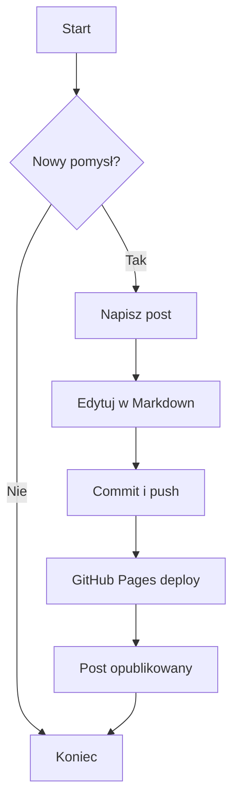

---
layout: post
title: "Przykladowy diagram Mermaid"
date: 2026-04-03 20:39:13 +/-0000
categories: [blog]
tags: [mermaid, diagram]
---
To jest przykładowy post z diagramem Mermaid.

Diagram przedstawia prosty flowchart procesu tworzenia posta.

Aby diagram był widoczny, strona musi mieć włączone Mermaid.js. Można dodać script do layoutu lub użyć pluginu Jekyll.

## Krótki opis
W tym poście pokazano, jak przejść od pomysłu do publikacji:
- utwórz plik w `_posts`
- wypełnij treść i front matter
- wykonaj `git add/commit/push`
- poczekaj na deploy GitHub Pages

Dzięki temu diagramowi widać, jak proste jest wdrożenie.

